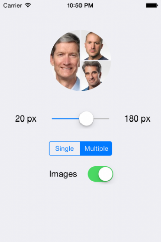

DNVAvatar
=========
Absolutely lightweight and responsive iOS Swift component which represents a round avatar or multiple avatars in a circle. It takes images with any aspect ratios and aligns them inside the sectors. Placeholders with initial letters may be presented while pictures are loading. DNVAvatar fully supports layout constraints.

This project also includes a controller intended to demonstrate the component in action:
<p align="center"></p>

Here is an example creation of the avatar and assigning it to the view. You can use a 2-item tuple in order to assign additional parts of multi-avatar:
```Swift
var jobsAvatar = DNVAvatar(initials: "SJ", backgroundColor: UIColor(hex: 0x8E8E93))
jobsAvatar.image = UIImage(named: "Steve Jobs")

avatarView.avatar = jobsAvatar
//avatarView.avatars = (secondAvatar, thirdAvatar)
avatarView.setNeedsDisplay()
```
